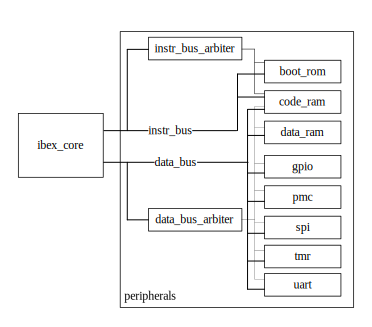

# pixel_riscv_soc

_pixel\_riscv\_soc_ is a System-on-Chip for calibration of pixelated hybrid X-ray detectors.

The main parts of the SoC are a RISC-V-based Central Processing Unit and a _Pixel Matrix Control
Coprocessor_. Integration of the mentioned processing units with the X-ray detector allowed to
perform an on-chip calibration.

The SoC architecture is shown in the figure below:
<p align="center"></p>


## Bitstream generation

To generate a bitstream containing _pixel\_riscv\_soc_ for
[_Arty A7-100_](https://reference.digilentinc.com/reference/programmable-logic/arty-a7/start)
development board, execute the following script:
```bash
./vivado_generate_bitstream.sh -t arty
```

You can use this script for a recompilation of an application executed by the RISC-V core:
```bash
./vivado_generate_bitstream.sh -r
```


## Development environment preparation

This section describes the CentOS 7 server preparation. The following commands must be executed with
the root privileges.


### Prerequisites

Add the EPEL repository to _yum_:
```bash
yum install -y epel-release
```

Install the standard packages:
```bash
yum install -y git gcc gcc-c++ autoconf automake python3 libmpc-devel mpfr-devel gmp-devel gawk \
bison flex texinfo patchutils zlib-devel expat-devel libgcc libgcc.i686 glibc-devel glibc-devel.i686 \
libmpc-devel srecord
```

CentOS 7 provides _gcc_ in version _4_. To compile the RISC-V toolchain, you have to install the
newer version from source:
```bash
wget https://ftpmirror.gnu.org/gcc/gcc-10.2.0/gcc-10.2.0.tar.gz
tar -zxf gcc-10.2.0.tar.gz
cd gcc-10.2.0 && ./contrib/download_prerequisities && cd ..
mkdir gcc-build && cd gcc-build
../gcc-10.2.0/configure -v --enable-languages=c,c++ --disable-multilib --program-suffix=-10.2
make -j $(nproc)
make install
```

Create the symbolic links:
```bash
ln -sf /usr/local/bin/gcc-10.2 /usr/local/bin/gcc
ln -sf /usr/local/bin/g++-10.2 /usr/local/bin/g++
```

Add the compile libraries to the dynamic linker search path:
```bash
export LD_LIBRARY_PATH=/usr/local/lib64/:/usr/local/lib/:$LD_LIBRARY_PATH
```


### RISC-V toolchain installation

Clone the RISC-V toolchain repository:
```bash
git clone https://github.com/riscv/riscv-gnu-toolchain.git --recursive
cd riscv-gnu-toolchain
```

Enable the bitmanip (bit manipulation) instructions support in _binutils_.
```bash
cd riscv-binutils && git checkout riscv-bitmanip && cd ..
```

Enable bitmanip instructions support in _gcc_:
```bash
cd riscv-gcc && git checkout riscv-bitmanip
```

Some instructions are not supported by the chosen RISC-V core, so it is necessary to disable them
in the cross compiler configuration:
```diff
diff --git a/gcc/config/riscv/bitmanip.md b/gcc/config/riscv/bitmanip.md
index dde28565079..f825ac5d58d 100644
--- a/gcc/config/riscv/bitmanip.md
+++ b/gcc/config/riscv/bitmanip.md
@@ -336,29 +336,6 @@

 ;;; ??? fs[lr]

-(define_insn "*shNadd"
-  [(set (match_operand:X 0 "register_operand" "=r")
-       (plus:X (ashift:X (match_operand:X 1 "register_operand" "r")
-                         (match_operand:QI 2 "immediate_operand" "I"))
-               (match_operand:X 3 "register_operand" "r")))]
-  "TARGET_BITMANIP
-   && (INTVAL (operands[2]) >= 1) && (INTVAL (operands[2]) <= 3)"
-  "sh%2add\t%0,%1,%3"
-  [(set_attr "type" "bitmanip")])
-
-(define_insn "*shNadduw"
-  [(set (match_operand:DI 0 "register_operand" "=r")
-       (plus:DI
-        (and:DI (ashift:DI (match_operand:DI 1 "register_operand" "r")
-                           (match_operand:QI 2 "immediate_operand" "I"))
-                (match_operand 3 "immediate_operand" ""))
-        (match_operand:DI 4 "register_operand" "r")))]
-  "TARGET_64BIT && TARGET_BITMANIP
-   && (INTVAL (operands[2]) >= 1) && (INTVAL (operands[2]) <= 3)
-   && (INTVAL (operands[3]) >> INTVAL (operands[2])) == 0xffffffff"
-  "sh%2addu.w\t%0,%1,%4"
-  [(set_attr "type" "bitmanip")])
-
 (define_insn "*addwu"
   [(set (match_operand:DI 0 "register_operand" "=r")
        (zero_extend:DI (plus:SI (match_operand:SI 1 "register_operand" "r")
```

Return to the root directory and install the RISC-V toolchain
```bash
cd ..
./configure --prefix=/opt/riscvb --with-arch=rv32imb --with-abi=ilp32
make -j $(nproc)
```

Add the cross compiler location to the _PATH_ environmental variable:
```bash
export PATH="$PATH:/opt/riscv/bin"
```

### Vivado installation

For the FPGA bitstream generation you have to install
[_Xilinx Vivado_](https://www.xilinx.com/support/download.html) and add its installation directory
(_bin_) to the _PATH_ environmental variable.


## Authors

Paweł Skrzypiec <pawel.skrzypiec@agh.edu.pl>

Robert Szczygieł <robert.szczygiel@agh.edu.pl>
